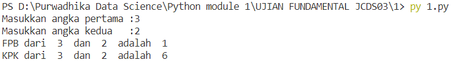

<h1 align='center'><b>
Ujian Python Data Science Fundamental </b></h1>
<p align='center'>
 </p>


## Soal 1 - FPB & KPK 
Buatlah sebuah file Python interaktif yang mengandung **sebuah function** untuk menentukan nilai **FPB** (Faktor Persekutuan Besar) & **KPK** (Kelipatan Persekutuan Kecil) dari 2 buah bilangan. Pembahasan seputar FPB & KPK pernah kita pelajari bersama di bangku Sekolah Dasar, masih ingat dong?

* **Case Flow**: Saat dieksekusi, program akan meminta user memasukkan 2 buah angka secara bebas. Kemudian user akan mendapatkan nilai FPB dan KPK dari 2 buah angka yang dimasukkan.

* Output yang diharapkan saat file diekseskusi via terminal:
    ```
    Ketik angka pertama     : 3
    Ketik angka kedua       : 2
    FPB dari 3 dan 2 adalah : 1
    KPK dari 3 dan 2 adalah : 6
    ```
#
## SYNTAX PYTHON
```python
def fpb(a,b):
    if a<b:
        smaller=a
    else:
        smaller=b
    for i in range (1,smaller+1):
        if a%i==0 and b%i==0:
            fpb=i
        # else:
        #     continue
    return fpb

def kpk(a,b):
    kpk=int(a*b/fpb(a,b))
    return kpk

a=int(input('Masukkan angka pertama :'))
b=int(input('Masukkan angka kedua   :'))

print('FPB dari ',a,' dan ',b,' adalah ',fpb(a,b))
print('KPK dari ',a,' dan ',b,' adalah ',kpk(a,b))
```
## OUTPUT



